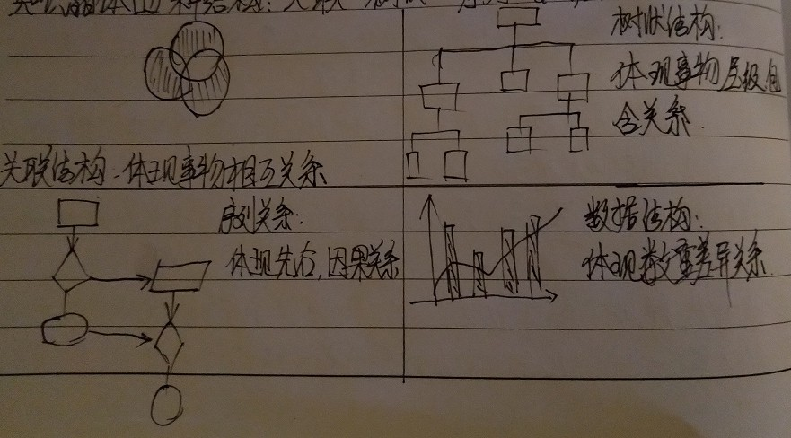

# 联机学习

1. 辨别和找到知识的源头
- 一手的研究论文，行业的学术期刊，行业的最新数据报告；
- 行业大牛的最新沟通和思考，最好能直接对话通过交流获得；
- 名校教科书，慕课网推荐的一手材料，维基百科；
- 中立的第三方行业报告；
- 讲述底层逻辑思考质量比较高略微难懂的书和文章；
- 各行业领军人物，行业大牛推荐的书单，及他们所发表的文章；

2. 功利读书法： 学习的东西是功利的，要从遇到的问题出发，寻找读书的材料，然后功利的分配资源去攻读，这类知识是需要大段时间系统去阅读。
    - 选书： 看书评，豆瓣、亚马逊等
    - 阅读： 看目录--->看具体章节介绍--->切入重点章节

3. 萃取知识晶 <-------> 形成自己的知识体系
   - 知识之间能够形成稳定的架构，知识就形成了知识晶体，共有四种结构

4. 联机学习中： 成为知识的路由器
    - 联机学习：和同行交流，用答案换答案；
    - 跨界联机学习： 跨行学习交流，用答案换答案；
    - 可以组成一个联机学习网络，多人一起学习并交流，多人的写作才能碰撞出思想的火花；
5. 终身提问，提问式学习： 问题比答案更有效。我们需要学习的是解决问题的知识，所以最好的方法是罗列问题清单。
   
    5.1 提问的方法
    - 不做伸手党，提问前准备充分，目标清晰；
    - 好问题都是组合拳；
    - 输出答案；
6. 知识IPO：
    - I：输入问题(Input a question),以解决问题为目标；
    - P：解决问题(Problem Soving), 以整合多学科为手段，用来解决问题；
    - O：输出产品(Output)，通过咨询研发，整合，让思想产品化；

    设计自己的IPO
    - 必须有一个真实的，高价值并且有可能被解决的问题(I)：
        - 提真实的问题
        - 提高价值的问题
        - 提能被解决的问题
    - 不要学习知识，而要解决问题(P)
    - 用输出倒逼输入(O)
        - 输出不一定要大，但一定要有，不要寄希望憋大招；
        - 用于分享，微博，微信，公众号，朋友圈等等
        - 碎片化更新并输出，利用碎片化的时间碎片化的更新
        - 设计自己的产品输出，哪怕很小
7. 努力构建自己的知识体系